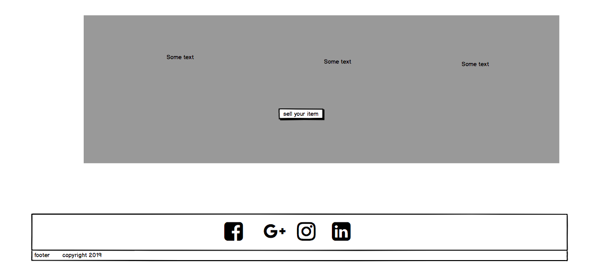
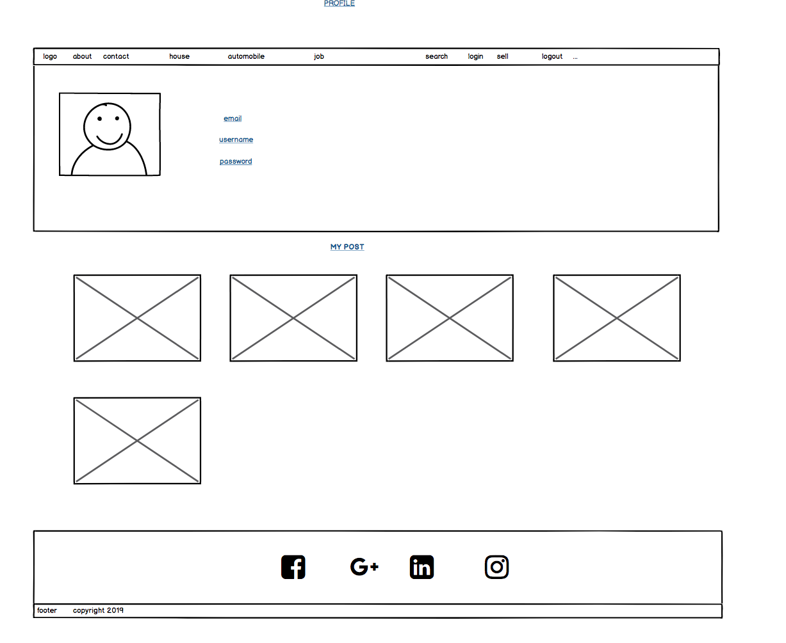
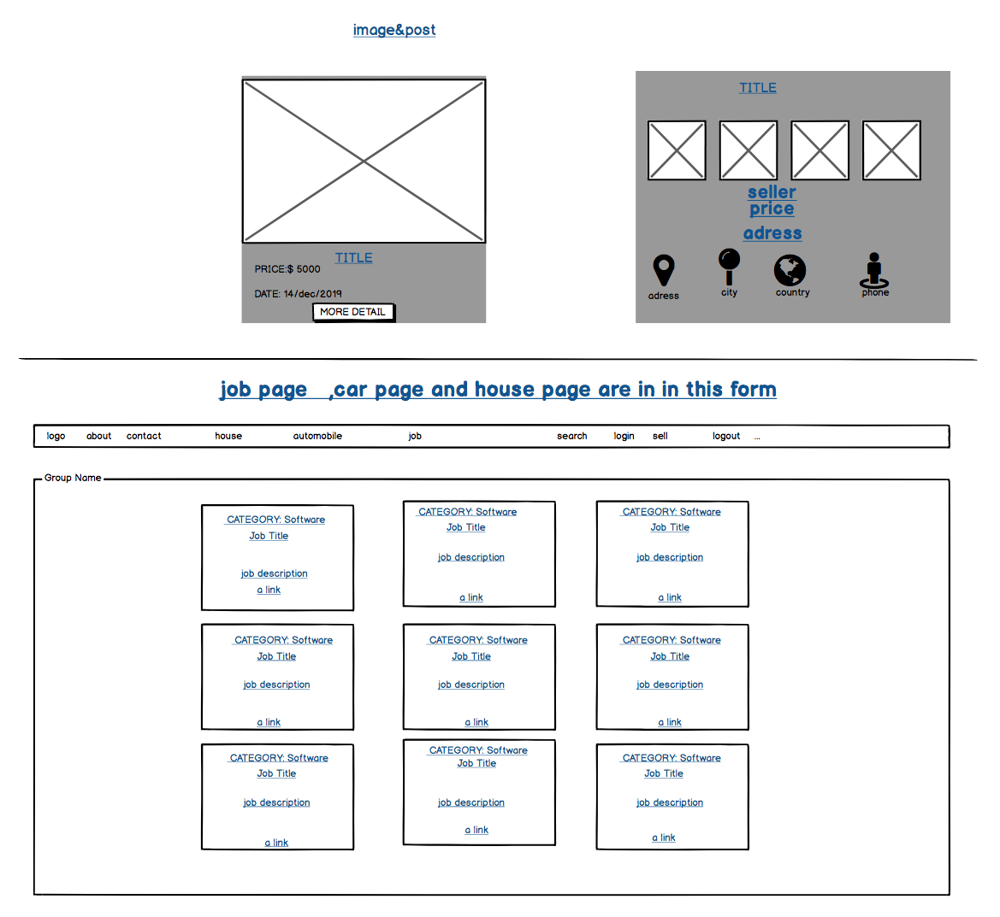
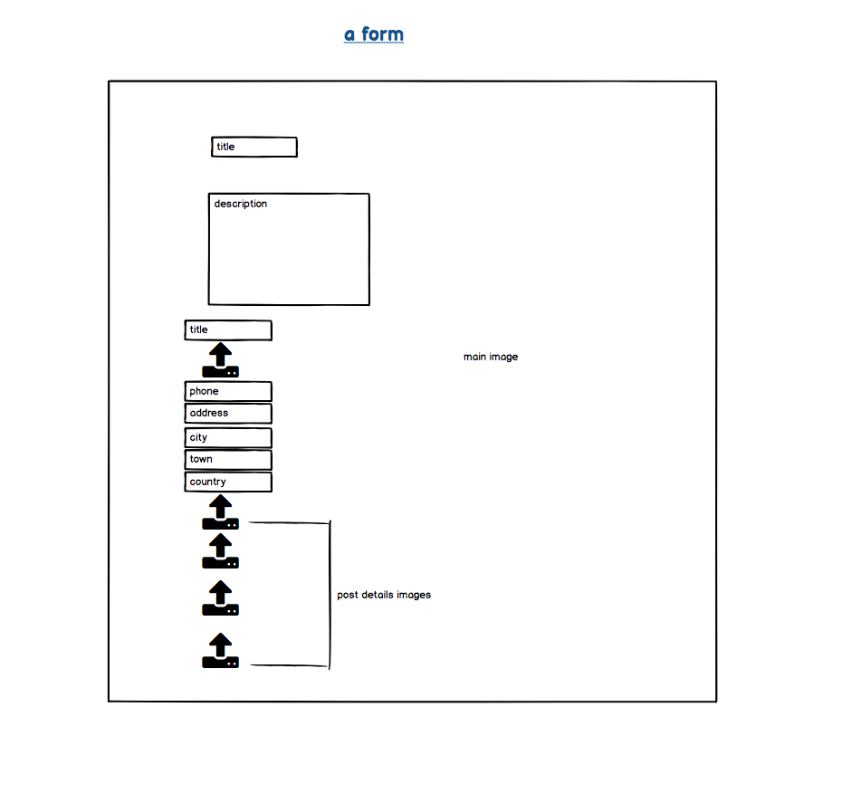
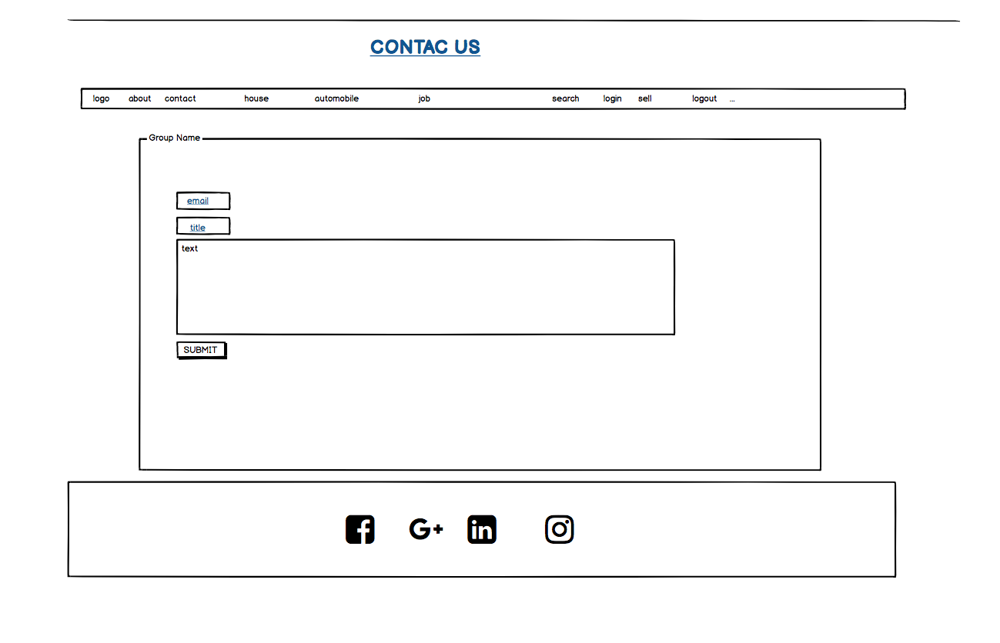
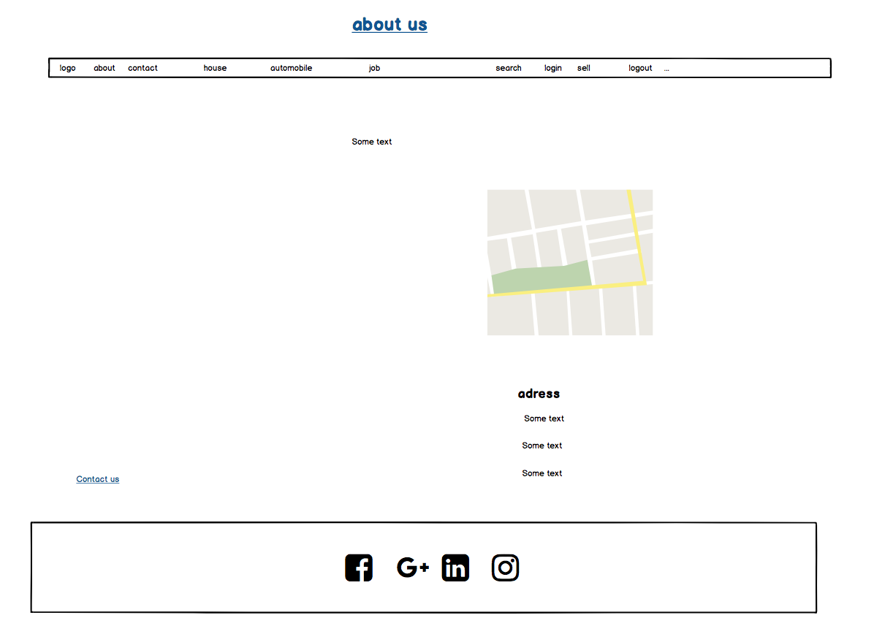
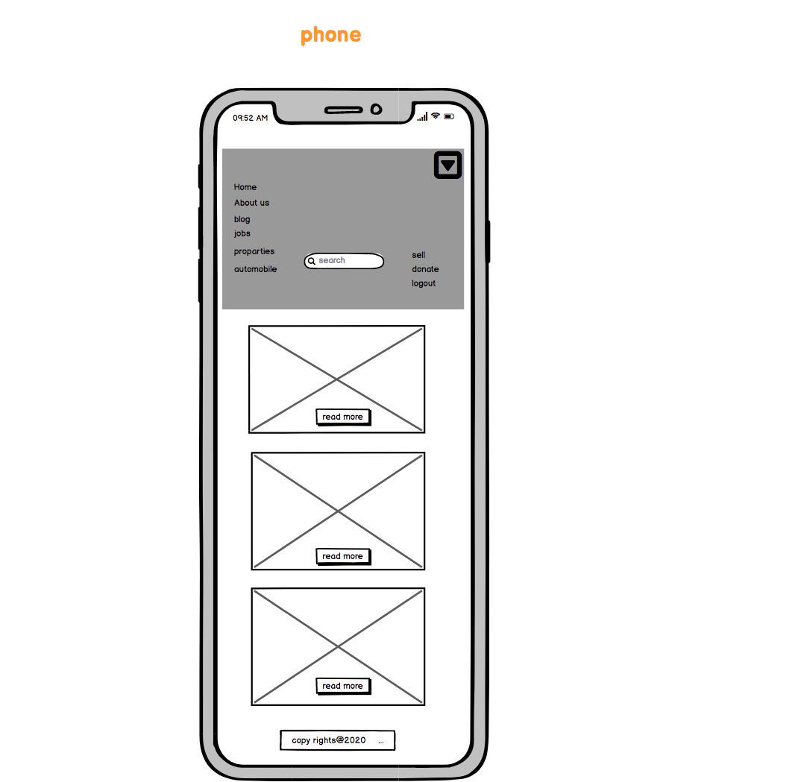
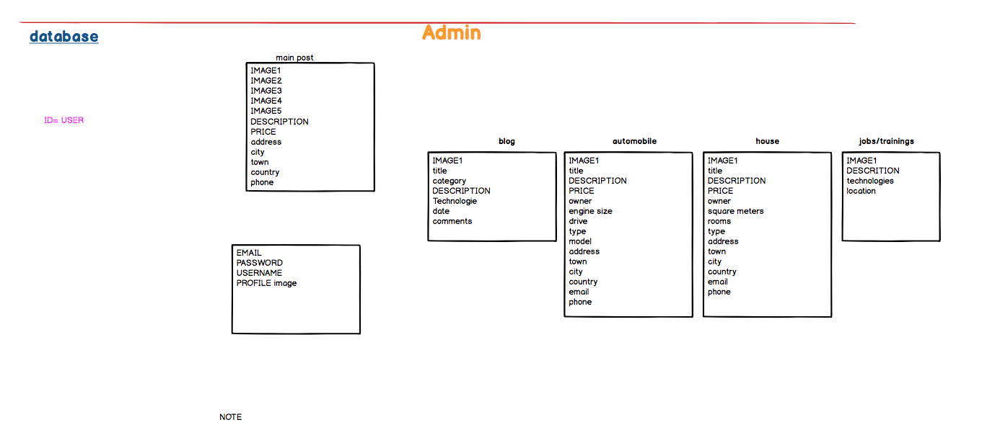

# [SAWASAWA-MARKET](https://sawasawa-market.herokuapp.com/)

---  
Full Stack Frameworks with Django, Python  - Milestone Project 4 for Code Institute by Frank Simplice MASABO

---

## Project Summary

Project Purpose: In this project, I made a full-stack site based around business logic used to control a centrally-owned dataset, has an authentication mechanism and provide payment access to the site using stripe payment system.

SAWASAWA-MARKET is envilonmental support website, you can sell your product free of charge, and donate some money by choice to save and protect envilonment, we provide adatabase controled apps where the owner of website can publish the advertise contents: cars, house for sale and rent, job publications, trainings, and blog where we publish contents that gives more knowledge to customers that use our website

## UX

### User Stories

- "SAWASAWA-MARKET site can be viewed from any device: PHONE, TABLETES, LAPTOP AND DESKTOP"
- "SAWASAWA-MARKET site have where I can search using text search, making it easy to find specific things"
- "payment option is very easy to handle"

### Design

### Color Scheme

Since the website a market place, I chose dark-orange, vibrant colors.

- Base color: White( #fff)
- Navigation,Footer color: dark-orange (#f3766f)
- buttons color: arange, blue, (Bootstap default)
- Title : green
- Date : blue

#### Ranguage

-Python3.7
-Javascript
-CSS
-HTML

#### Framework

- [Bootstrap 4]( https://getbootstrap.com/ )
- [jQuery 3.4.1](https://code.jquery.com/jquery/)
    -In an effort to keep the JavaScript minimal, I have decided to use jQuery as foundation to my scripts framework.
- [Django 3.0.2](https://www.djangoproject.com/download/)
    -Django is a free and open-source web framework that I've used to render the back-end Python with the front-end Bootstrap.

#### Icons

- [mdbootstrap icons](https://mdbootstrap.com/)
- [pictures]was taken from:[UNSPLASH](https://unsplash.com/)
and:[Pinterest](https://www.pinterest.se/)

#### Typography

 -2 [Google Fonts](https://fonts.google.com/) were used across the site:
'Rajdhani', sans-serif;

## WIREFLAME BY BALSAMIQ

### Main Page


### afaotter



### Profile



### Post detail



### post form



### Contact Us



### About us



### Phone



### Database schema



## Features

### Base template (navbar & footer)

- Navbar
    -Site logo to navigate back to homepage.
    -Home button to navigate back to homepage.
    -Login button for existing users to log back in.
    -Register button for new users to register.
      Once the user has logged in.
    -removal of login and register button.
    -Logout button to end their session.
    -Explore drop down to enable users to navigate the site from any html page.
    -Search bar enabling users to search for products via key words.
    -Contact form enabling users to submit contact requests.
    -Social media buttons to share contents with friends

### Index (homepage)

- Register button which is hidden if user is already registered.
- Icons which link to different parts of the site.
- donation button to take the user on donation form

### Posts

- Index page users can see all the posts
- Pagination to only display 8 posts per page.
- Users can straight away sell his/her item.
- Users can go to detailed view post to check price details and other details of the product. From detailed view page also user can contact the owner of item
- Products can be searched by search through Navigation bar.

### Profile page

-User can add profile details: picture, email, usename
-Users can see their profile details, update, delete or edit

### Contact Page

- The contact page contains a form for the user to fill in to send the website owner an email.
- Name, email address, message are all required fields so that the website owner receives all the information she/he needs to respond.
- When the user clicks "send" the email is processed and sent via emailjs to Owner’s email address and user has been notified via message that the owner have received the email.

### Register Page

- A user who is not logged in can create a new account using the register page. The page on this form includes a username (which must be unique), email address, password and password confirmation fields.  
- Information about what characters are accepted by these fields is displayed with the form.
- If a user who is already logged in tries to access this page, they are redirected to the home page.
- After registration, user will be notified via a message.

### Login Page

-The login page features a standard login form asking for username and password.
-Validation for this form is handled in the back end and relevant feedback is sent to the user when they sign in.
-User can reset password if needed from this page.

### Log out page

-Any user who clicks on "Log out" from the navigation bar is automatically logged out and their session data cleared.

### Checkout page

- You found a donation page with the summary of what your donation will do
- You get a button from stripe showing that you are going to donate 20usd from there, the button will take you to the form where you will fill up your card, expiration date, year and vvc
- When you click donate the money will be charged from your form, and you will be notified by a message.

### Blog Page

- The blog is controlled by the admin
- User can read and give comments.
- Comments will be displayed under the post, and the name of a writer.
- You can share on social media if you want

## Technologies Used

Languages:
-[HTML](https://en.wikipedia.org/wiki/HTML)
-[CSS](https://en.wikipedia.org/wiki/Cascading_Style_Sheets)
-[JavaScript](https://developer.mozilla.org/en-US/docs/Web/JavaScript)
-[Python 3](https://www.python.org/download/releases/3.0/)
-[postgresql](https://www.postgresql.org/)

Framework / Libraries
-[jQuery](https://jquery.com/)
-[Django](https://docs.djangoproject.com/en/3.0.2/)
-[mdbootstrap](https://mdbootstrap.com/)
-[Stripe](https://stripe.com/gb)

Tools:
-[Git](https://en.wikipedia.org/wiki/Git)

Databases:
-[SQLite](https://www.sqlite.org/docs.html)
-[PostgreSQL](https://www.postgresql.org/docs/)

## Testing

A thorough mix of automated and manual testing have gone into building the project. In addition to tests, I have validated all files against online validation sites, and checked compatibilities across various modern browsers and devices.

### Validation services

-I used [This HTML validator](https://validator.w3.org/) to ensure my code was legal.
    - The only warnings were when the validator failed to recognise the Django template tags.
-I used [This CSS validator](https://jigsaw.w3.org/css-validator/) to ensure my CSS was legal.

<p> 
<ahref="http://jigsaw.w3.org/css-validator/check/referer">
                    
                </a>
</p>
-I used [This Python validator](http://pep8online.com/) to ensure my Python was legal.

### Stripe payment testing

Please use the below information to test payments.

- Card number - 4242424242424242
- CVC - Any 3 digit number.
- Expiry date - Any date in the future.

### Manual tests

- Check logging in and out, views change accordingly
- Check registering as new user and logging in and out and in again
- Check all links in navbar and footer, confirm opening in new tabs
- Click 'Forgot password' and confirm email link
- Check switching between pages
- Contact Us form is working fine.
- Checkout function is working fine.
- Check that search field is working perfectly
- Change things in the admin panel and try to break stuff (e.g. delete a user and then check profile removed by CASCADE)

# Deployment

## How to run this project locally

To run this project on your own IDE follow the instructions below:

Ensure you have the following tools: 
-An IDE such as [VS CODE](https://code.visualstudio.com)

The following **must be installed** on your machine:
-[PIP](https://pip.pypa.io/en/stable/installing/)
-[Python 3](https://www.python.org/downloads/)
-[Git](https://gist.github.com/derhuerst/1b15ff4652a867391f03)

### Instruction

1.Save a copy of the github repository located at https://github.com/frankkode/sawasawa-market by clicking the "download zip" button at the top of the page and extracting the zip file to your chosen folder. If you have Git installed on your system, you can clone the repository with the following command.
```git clone https://github.com/frankkode/sawasawa-market```
2.If possible open a terminal session in the unzip folder or cd to the correct location.

3.Install all required modules with the command:  
```pip -r requirements.txt.```
4.Attempt to run project where you will get an error message displaying your host name.
```python3 manage.py runserver```
5.In your settings.py file add your hostname under 'ALLOWED_HOSTS'.

6.Create a [stripe](https://stripe.com/gb) account and get your API keys.

7.In your local IDE create a file called `env.py`.

8.Inside the env.py file create the below variables.
    - SECRET_KEY
    - STRIPE_PUBLISHABLE
    - STRIPE_SECRET
    - DEFAULT_FROM_EMAIL
    - SERVER_EMAIL
    - EMAIL_HOST
    - EMAIL_HOST_USER
    - EMAIL_HOST_PASSWORD

9.You can now re-run the runserver command to view local project.
```python3 manage.py runserver $IP:$PORT```
10.Note - If you are having issues viewing static files you may need to collect static with the below command.
```python3 manage.py collectstatic```

## Heroku Deployment

To deploy SAWASAWA-MARKET to heroku, take the following steps:

1. Create a `requirements.txt` file using the terminal command `pip freeze > requirements.txt`.

2. Create a `Procfile` with the terminal command `echo web: python app.py > Procfile`.

3. `git add` and `git commit` the new requirements and Procfile and then `git push` the project to GitHub.

3.Create a new app on the [Heroku website](https://dashboard.heroku.com/apps) by clicking the "New" button in your dashboard. Give it a name and set the region to Europe.

4.From the heroku dashboard of your newly created application, click on "Deploy" > "Deployment method" and select GitHub.

5.Confirm the linking of the heroku app to the correct GitHub repository.

6.In the heroku dashboard for the application, click on "Settings" > "Reveal Config Vars".

7.Set the following config vars:

| Key | Value |
 --- | ---
SECRET_KEY | `<your_secret_key>`
STRIPE_PUBLISHABLE | `<your_stripe_publishable>`
STRIPE_SECRET | `<your_stripe_secret>`
DEFAULT_FROM_EMAIL | `<your_from_email>`
SERVER_EMAIL | `<your_server_email>`
EMAIL_HOST | `<your_email_host>`
EMAIL_HOST_USER | `<your_host_user>`
EMAIL_HOST_PASSWORD | `<your_host_password>`

8.In the Heroku dashboard, click "Deploy".

9.In the "Manual Deployment" section of this page, make sure that the master branch is selected and then click "Deploy Branch".

10.The site is now successfully deployed.

## Acknowledgements

- The tutors, mentors and support staff at [Code Institute][5]
- My mentor Anthony Ngene
- My wife Yvette Iradukunda who encouraged me and support me in different ways

## Disclaimer

The content of this Website is for educational purposes only.

[5]: https://codeinstitute.net/full-stack-software-development-diploma/
[13]: https://docs.python.org/3/